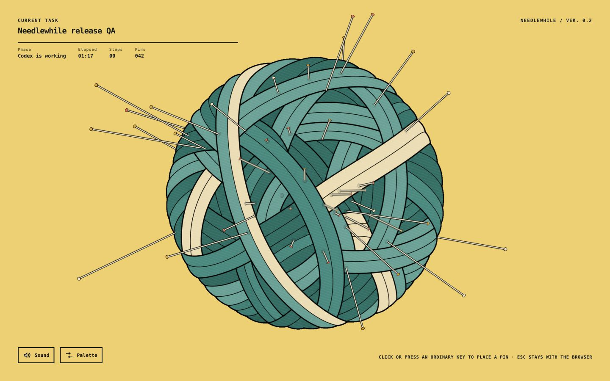

[English](README.md) · [简体中文](README.zh-CN.md) · **日本語** · [한국어](README.ko.md) · [हिन्दी](README.hi.md)

# Coder Massage / coder马杀鸡

> AIの待ち時間に、小さな所作を。<br>
> *Small rituals for AI gap time.*

Coder Massage / coder马杀鸡 は、AIエージェントと一緒にものをつくる人のための、集中力をほとんど使わずに遊べるオプトインの小さなゲーム集です。既存のインストールとの互換性を保つため、リポジトリの技術IDは `jieya` のままです。

<p align="center">
  
</p>

## なぜつくるのか

バイブコーディングでは、プロンプトを渡したあと、AIエージェントが処理を続けるあいだに短い待ち時間が生まれます。私たちはこの時間を **AI gap time** と呼んでいます。SNSやニュースフィード以外にも、この時間の過ごし方があってよいと考えました。

仕事中の遊びには独特の条件があります。数秒で始められること、急に中断できること、音を出す必要がなく、長時間の集中を求めないこと、そして作業へ無理なく戻れること。スコア、ストリーク、フィード、必須の進行要素はありません。成果や勝敗を求めない、集中力をほとんど使わない遊びも、日々のウェルビーイングを支える小さな道具になり得ます。

私たちのチームは、ゲームそのものに加えて、人とAIがどんなリズムで働き、待ち、また仕事へ戻るのかを設計しています。

## 現在のゲーム

現在インストールして試せるのは、**[Needlewhile / 扎会儿](./games/needlewhile/)** だけです。

マウスボタンをクリックするか、通常のキーを押すと、毛糸玉に針が一本刺さります。それだけの、ごく小さな動作です。AIが作業しているあいだ、少しだけ手を動かし、終わったらそのまま戻れます。ポータルは常にオプトインで、ユーザーが入ることを選ぶまでブラウザは開きません。

| No. | ゲーム | カテゴリー | 状態 | インストール |
| --- | --- | --- | --- | --- |
| 01 | **Needlewhile / 扎会儿** | 触覚 | ユーザーテスト中 | 可能 |

## これから

今後、コレクションポータルは対象ゲームから1つをランダムに選びます。ゲーム内スイッチャーで別のゲームへ移っても、同じAIタスクのタイマーは継続します。

ゲームの数を急いで増やすより、AIとの待ち時間に本当に馴染むものを一つずつ検証していきます。新しいコンセプトは、自己完結したパッケージ、検証、リリース状態がそろうまで、インストール可能なカタログには入りません。

```text
現在：ポータル → Needlewhile
将来：ポータル → ランダムなゲーム ↔ ゲーム内スイッチャー ↔ ほかのゲーム
```

詳しくは、[ゲーム一覧](./games/README.md)、[アーキテクチャ](./docs/ARCHITECTURE.md)、[ポータル仕様](./docs/PORTAL.md)をご覧ください。

## ステータス

| 項目 | 状態 |
| --- | --- |
| Coder Massage / coder马杀鸡 | 初期開発中 |
| Needlewhile / 扎会儿 | インストール可能・ユーザーテスト中 |
| ポータルによるランダム選択 | 予定 |
| ゲーム内スイッチャー | 予定 |
| その他のゲーム | まだ公開されていません |

## クイックインストール

リポジトリのルートで実行します。

```sh
sh ./install.sh --codex
```

詳しい手順と仕組み：

- [インストールガイド](./docs/INSTALLATION.md)
- [アーキテクチャ](./docs/ARCHITECTURE.md)
- [ゲーム追加ガイド](./docs/ADDING_A_GAME.md)
- [ゲーム一覧](./games/README.md)

## インストール時の役割

AIアシスタントは、前提条件の確認、リポジトリのダウンロード、インストーラーの実行、結果の検証を行えます。Codex Hook の承認は所有者だけが行うセキュリティ操作です。所有者自身が `UserPromptSubmit`、`PostToolUse`、`Stop` を確認してください。アシスタントが所有者に代わって Hook を承認したり、信頼記録を書き換えたりしてはいけません。詳しくは[インストールと検証のルール](./docs/INSTALLATION.md#installation-responsibilities)をご覧ください。

## 名前について

`Coder Massage / coder马杀鸡` はプロダクト名です。`jieya` は、リポジトリとプラグインマーケットプレイスの互換性を保つためのIDです。`Needlewhile / 扎会儿` は、現在テスト中の最初のゲーム名です。基準となる Codex プラグインIDは `needlewhile@jieya` です。

## プライバシー

現在のビルドはローカルで動作します。コントローラーはランダムなアクセストークンを使い、`127.0.0.1` のみにバインドされます。タスク名は短く安全な形に整えてメモリ内だけで扱い、プロンプト本文はディスクへ保存しません。グローバルなキー監視、アクセシビリティ権限、分析、アカウント、広告、外部ゲームサービスは使用しません。

## ライセンス

MIT。Magic Fan によるアーリーアクセス開発版です。
