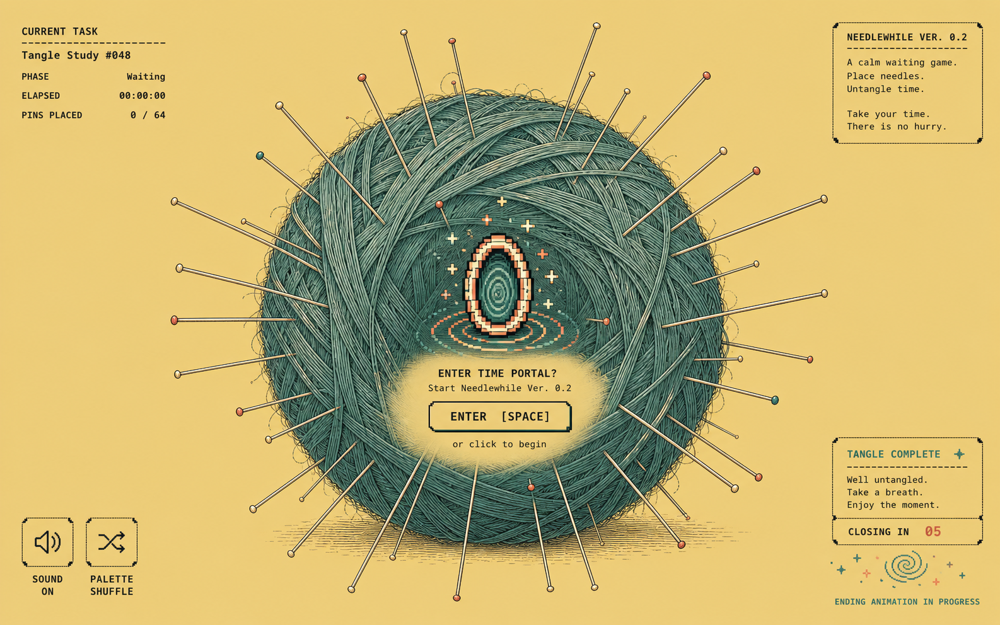

# Jieya · Ver.0.2

### Small tactile rituals for the time between a prompt and an answer.

Jieya is a private collection of low-attention decompression games for people working with AI agents. The first playable game is **Needlewhile / 扎会儿**.

<p align="center">
  
</p>

## What changed in Ver.0.2

- **Browser-safe task start:** trusted Codex hooks quietly track state and request one small inline Portal. They never launch, maximize, resize, profile, or switch a browser. The system default browser opens a normal tab only after a user click or explicit `open` command.
- **Pixel time Portal:** the small animated time vortex appears with a top-level Codex task; the user still chooses when to enter the game.
- **Browser keys stay usable:** `Escape`, `F11`, Tab, and modifier shortcuts never place needles.
- **Concrete task state:** the upper-left readout shows a sanitized task label, agent client, elapsed time, tool steps, and pin count.
- **A real ending:** the final lifecycle event starts an eight-second close countdown and pixel closing performance.
- **More variation:** a control shuffles paired background/yarn palettes; needle targets cover the center, front face, rim, foreground, and background.
- **Finer yarn:** a masked fiber layer adds delicate strands over the transparent illustrated ball.
- **Safer multi-client runtime:** leases are namespaced by client/session/run, stale endings cannot kill replacement turns, and concurrent starts share a protocol-checked controller.

## Game 01

| No. | Game | Status | Ritual |
| --- | --- | --- | --- |
| 01 | **[Needlewhile / 扎会儿](./games/needlewhile/)** | Ver.0.2 | Open the Portal when you want it, then click or press an ordinary key to sink a needle into the yarn. |

<details>
  <summary>Open the Ver.0.2 visual concept</summary>
  <p align="center">
    
  </p>
</details>

## Requirements

- Node.js 18 or newer
- A local default browser
- Codex or Claude Code for bundled native lifecycle hooks
- Any other local agent host capable of invoking lifecycle commands for the generic adapter

There are no npm runtime dependencies and no build step.

## Run locally

An explicit demo both starts a manual interval and opens the Portal:

```bash
npm run demo
```

Useful commands:

```bash
npm run open
npm run status
npm run stop
npm run shutdown
npm run validate
```

## Install in Codex

```bash
gh repo clone magicfanshanghai-sys/jieya
cd jieya
./install.sh --codex
```

On Windows PowerShell:

```powershell
.\install.ps1 -Target codex
```

The installer attempts to open `codex://plugins/needlewhile@jieya` for review. In Codex desktop, typing `hooks` or `/hooks` in the chat box does not open Hook authorization. Use **Settings → Plugins → Needlewhile → Review → Trust all**, after inspecting the commands. Hook authorization is complete only when all three Needlewhile hooks show **Trusted**.

In Codex CLI, use `/hooks` with the leading slash, inspect the same three commands, and trust them there. Installing or updating may change an exact command hash, which intentionally requires another review. Never edit or bypass Hook trust. The hooks update local state; they do not open a window. Ask Codex to “打开 Needlewhile 时空门” when you want to play.

Until review is complete, the installer prints `NEEDLEWHILE_STATUS=pending` and exits with code `2`. After trusting all three Hooks, verify directly with `node games/needlewhile/scripts/codex-hook-doctor.mjs`. When it reports ready, fully quit and reopen Codex once so existing projects discard old skill and MCP-process snapshots, then start a fresh top-level task. Do not rerun the installer after the doctor succeeds.

## Install in Claude Code

```bash
gh repo clone magicfanshanghai-sys/jieya
cd jieya
./install.sh --claude
```

On Windows PowerShell:

```powershell
.\install.ps1 -Target claude
```

Claude Code additionally uses `StopFailure` and `SessionEnd` cleanup hooks. Ask Claude Code to open the Needlewhile Portal when you want the normal browser tab.

## Lifecycle and entry flow

```text
prompt submitted ──► local state lease begins ──► agent works
                              │
explicit “open Portal” ───────┴──► default browser tab ─► click vortex ─► game
                                                                  │
turn ends ─────────────────────────────────────────────────────────┴──► countdown + ending
```

A new turn replaces only the stale lease from the same client and session. A delayed ending from an older run has no effect. Codex, Claude Code, and generic adapter clients can use identical session/run IDs without colliding.

## Other agent clients

The shared protocol accepts JSON on standard input and one command per lifecycle phase:

```text
node skills/needlewhile/scripts/lifecycle.mjs start     --client workbuddy
node skills/needlewhile/scripts/lifecycle.mjs heartbeat --client workbuddy
node skills/needlewhile/scripts/lifecycle.mjs stop      --client workbuddy
node skills/needlewhile/scripts/lifecycle.mjs error     --client workbuddy
node skills/needlewhile/scripts/lifecycle.mjs cleanup   --client workbuddy
node skills/needlewhile/scripts/lifecycle.mjs open
```

Replace `workbuddy` with `coze` or another stable client name. Native packaging is included for Codex and Claude Code. WorkBuddy/扣子 adaptation uses this command bridge when the host offers local lifecycle hooks or command execution. A cloud-only bot cannot reach a user's loopback UI. See [`CLIENT_ADAPTERS.md`](./games/needlewhile/CLIENT_ADAPTERS.md).

## Privacy and safety

- The controller binds only to `127.0.0.1` and uses a random access token.
- The sanitized task label is capped at 88 characters and stays in controller memory.
- Raw prompt text is never written to disk.
- No global keyboard monitoring, Accessibility permission, analytics, accounts, ads, or remote game service.
- The persistent discovery file contains only PID, port, token, version, protocol version, and startup time.

## Versions

- Jieya/design release: **0.2.0 / Ver.0.2**
- Needlewhile plugin/runtime: **0.4.4** (verified three-Hook trust handoff, upgrade-safe click path, and the saturated borderless pixel-art Portal)
- Lifecycle protocol: **2**

## Repository layout

```text
.agents/plugins/marketplace.json       Codex collection catalog
.claude-plugin/marketplace.json        Claude Code collection catalog
games/needlewhile/                     Self-contained Game 01 plugin
games/needlewhile/.codex-plugin/       Codex plugin manifest
games/needlewhile/.claude-plugin/      Claude Code plugin manifest
games/needlewhile/skills/              Shared skill, bridge, and local game
games/needlewhile/design/              Concepts and browser-verified preview
scripts/validate.mjs                   Collection validator
install.sh / install.ps1               Collection installers
MANIFEST.sha256                        Repository integrity hashes
```

## License

MIT. The repository remains private while the collection is being developed.
