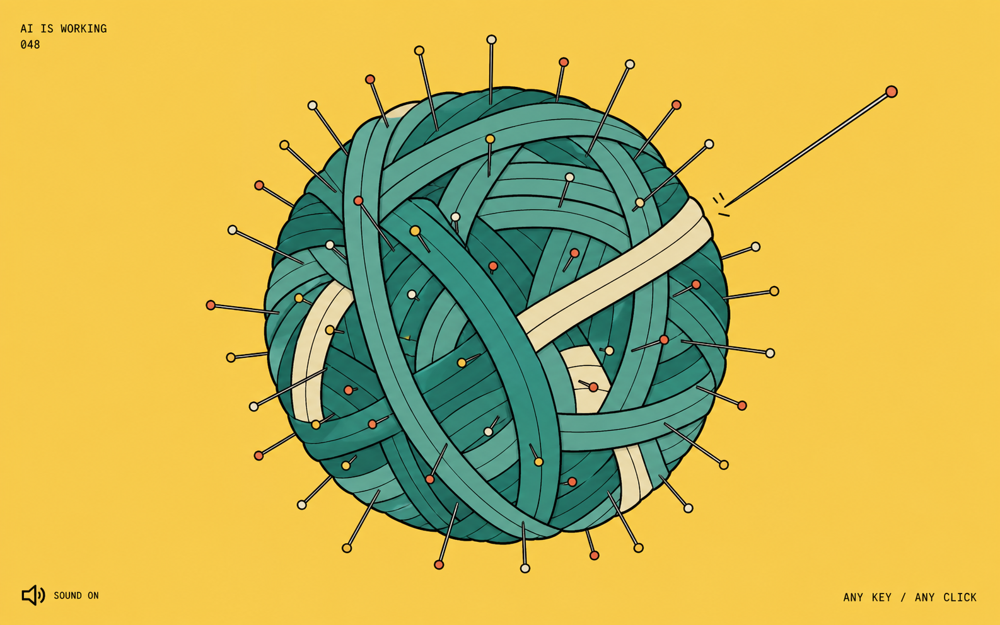

# Jieya

### Small tactile rituals for the time between a prompt and an answer.

Jieya is a private collection of low-attention decompression games for people using Codex and Claude Code. Each game is designed to occupy the hands without demanding a second train of thought, then react to the lifecycle of the active AI turn.

The first playable game is **Needlewhile**.

<p align="center">
  
</p>

## Games

| No. | Game | Status | Ritual |
| --- | --- | --- | --- |
| 01 | **[Needlewhile / 扎会儿](./games/needlewhile/)** | Playable MVP | Press almost any key, left-click, or right-click to sink a needle into a floating yarn ball. |

More games can join the collection as self-contained skills while sharing the same privacy and lifecycle principles.

## Needlewhile

Needlewhile turns an AI waiting period into a tiny, repeatable physical gesture:

- A bright full-screen illustrated scene with no score, streak, timer, or reward loop.
- Long, slender needles that gradually sink into the yarn so the interaction can continue indefinitely.
- Layered procedural sound: a fine tip transient, soft wool compression, and a short dry rustle.
- Keyboard, left-click, and right-click input.
- Automatic freeze and audio stop when the active agent turn finishes.
- Separate Codex and Claude Code hook manifests over one shared local game.

The current art direction uses a solid butter-yellow field, cool teal and cream yarn, sparse corner copy, and hand-inked contours.

<details>
  <summary>Open the accepted visual concept</summary>
  <p align="center">
    
  </p>
</details>

## Requirements

- Node.js 18 or newer
- Google Chrome or Microsoft Edge for the requested full-screen app window
- Codex or Claude Code for automatic lifecycle hooks

There are no npm runtime dependencies and no build step.

## Run locally

```bash
npm run demo
```

Useful commands:

```bash
npm run status
npm run stop
npm run shutdown
npm run validate
```

Press `Escape` to leave browser full-screen mode.

## Install in Codex

Clone the private repository with an authenticated GitHub account:

```bash
gh repo clone magicfanshanghai-sys/jieya
cd jieya
./install.sh --codex
```

On Windows PowerShell:

```powershell
.\install.ps1 -Target codex
```

Manual installation:

```bash
codex plugin marketplace add "$PWD"
codex plugin add needlewhile@jieya
```

Restart Codex, open `/hooks`, inspect the three Needlewhile commands, and trust them. Needlewhile starts on `UserPromptSubmit`, refreshes its lease after tool calls, and freezes on `Stop`.

## Install in Claude Code

```bash
gh repo clone magicfanshanghai-sys/jieya
cd jieya
./install.sh --claude
```

On Windows PowerShell:

```powershell
.\install.ps1 -Target claude
```

Manual installation:

```bash
claude plugin validate "$PWD/games/needlewhile"
claude plugin marketplace add "$PWD"
claude plugin install needlewhile@jieya
```

Claude Code additionally uses `StopFailure` and `SessionEnd` cleanup hooks. Claude Code 2.1.196 or newer is recommended.

## How the lifecycle works

```text
prompt submitted
      ↓
local controller starts or refreshes a run lease
      ↓
Needlewhile opens and accepts input
      ↓
agent turn stops, fails, or ends
      ↓
sound fades out and the scene freezes
```

A newly submitted turn in the same session replaces a stale interrupted-turn lease. Concurrent sessions remain independent.

## Privacy and safety

- The controller binds only to `127.0.0.1`.
- A random access token is stored under the operating system temporary directory.
- Prompt content is never saved or displayed.
- There is no global keyboard monitoring or Accessibility permission.
- There are no analytics, accounts, ads, scores, or remote game services.

## Repository layout

```text
.agents/plugins/marketplace.json       Codex collection catalog
.claude-plugin/marketplace.json        Claude Code collection catalog
games/needlewhile/                     Self-contained Game 01 plugin
games/needlewhile/.codex-plugin/       Codex plugin manifest
games/needlewhile/.claude-plugin/      Claude Code plugin manifest
games/needlewhile/skills/              Shared skill and local game
games/needlewhile/design/              Concept and implementation preview
scripts/validate.mjs                   Collection validator
install.sh / install.ps1               Collection installers
MANIFEST.sha256                        Repository integrity hashes
```

## Validation

The current release passes 11 automated checks covering:

- plugin and hook schemas
- JavaScript syntax
- production image assets
- bounded and decaying procedural audio data
- full-screen launch flags
- normal, concurrent, background, and interrupted-turn lifecycle paths
- loopback server delivery

The interface was also checked at `1586 × 992` and `390 × 844`, including dense needle states, sound toggling, right-click input, and input lock after completion. See [`design-qa.md`](./games/needlewhile/design-qa.md) for the full record.

The current build was validated on macOS with Node.js 22 and Codex CLI. The Claude Code manifest and hook schema were validated with Claude-shaped lifecycle fixtures; the Claude Code CLI and Windows/Linux runtime paths were not executed end-to-end on the build machine. See [`PACKAGE_INFO.md`](./games/needlewhile/PACKAGE_INFO.md) for the tested boundary.

## Current boundary

Chrome and Edge are asked to open Needlewhile as a full-screen browser app. A normal browser tab remains the fallback and cannot guarantee its launch mode. A future native shell can add a menu-bar or tray icon, always-on-top behavior, and signed macOS and Windows installers without changing the game protocol.

## Roadmap

- Add more one-gesture waiting games to the Jieya collection.
- Introduce a lightweight game picker without adding attention-heavy progression systems.
- Explore a native shell for stronger cross-platform window control.
- Add optional local sound preferences shared across sessions.

## License

MIT. The repository is currently private while the collection is being developed.
